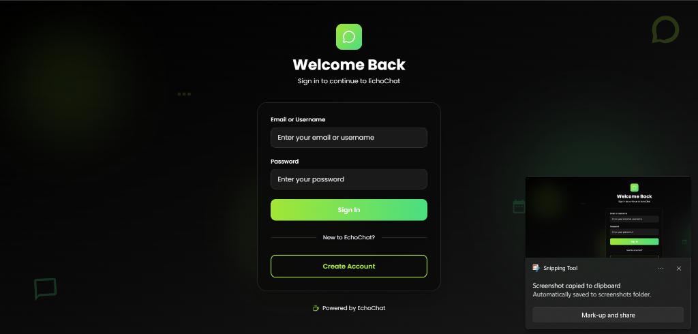
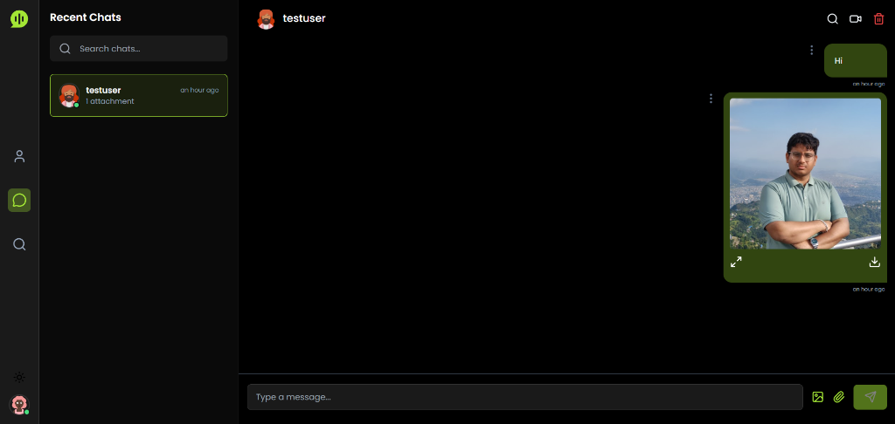

# EchoChat 💬

A modern, real-time chat application built with React, Node.js, Socket.IO, and WebRTC. Features include instant messaging, video calling, and a beautiful dark/light theme with lime green accents.


## ✨ Features

- **Real-time Messaging** - Instant chat with Socket.IO
- **Video Calling** - Built-in WebRTC video calls with screen sharing
- **Email OTP Verification** - Secure registration with EmailJS
- **Dark/Light Mode** - Beautiful themes with lime green accents
- **File Sharing** - Share images and files in chats
- **Responsive Design** - Works on desktop and mobile
- **User Search** - Find and connect with other users
- **Online Status** - See who's online in real-time
- **Typing Indicators** - Know when someone is typing

## 🖼️ Screenshots

### Login Page

*Beautiful animated login page with glassmorphism effects*

### Chat Interface - Light Mode

*Clean and modern chat interface with image sharing*

### Chat Interface - Dark Mode

*Sleek dark mode with lime green accents*

## 🚀 Tech Stack

### Frontend
- **React 18** - Modern UI library
- **Vite** - Lightning-fast build tool
- **TailwindCSS** - Utility-first CSS framework
- **Lucide React** - Beautiful icon set
- **Socket.IO Client** - Real-time communication
- **WebRTC** - Video calling functionality
- **EmailJS** - Email OTP verification

### Backend
- **Node.js** - JavaScript runtime
- **Express** - Web framework
- **TypeScript** - Type safety
- **MongoDB** - NoSQL database
- **Socket.IO** - WebSocket server
- **JWT** - Authentication
- **Bcrypt** - Password hashing

### Video Calling
- **WebRTC** - Peer-to-peer video/audio
- **Socket.IO Signaling Server** - Connection coordination

## 📦 Project Structure

```
echochat/
├── client/                 # React frontend
│   ├── src/
│   │   ├── components/    # Reusable components
│   │   ├── pages/         # Page components
│   │   ├── context/       # React contexts
│   │   ├── services/      # API services
│   │   └── utils/         # Utility functions
│   └── public/            # Static assets
│
├── backend/               # Node.js backend
│   ├── src/
│   │   ├── controllers/  # Request handlers
│   │   ├── models/       # Database models
│   │   ├── routes/       # API routes
│   │   └── server.ts     # Entry point
│   └── public/           # Public files
│
└── signaling-server/     # WebRTC signaling
    └── server.js         # Socket.IO server
```

## 🛠️ Installation

### Prerequisites
- Node.js (v16 or higher)
- MongoDB
- EmailJS account (for OTP)

### 1. Clone Repository
```bash
git clone https://github.com/ajaybaral/Chat.git
cd Chat
```

### 2. Setup Backend
```bash
cd backend
npm install
```

Create `backend/.env`:
```env
NODE_ENV=development
PORT=5000
CORS_URL=http://localhost:5173
SERVER_URL=http://localhost:5000
DB_URL=mongodb://localhost:27017/
DB_NAME=EchoChat
COOKIE_VALIDITY_SEC=172800
ACCESS_TOKEN_VALIDITY_SEC=182800
REFRESH_TOKEN_VALIDITY_SEC=604800
TOKEN_ISSUER=api.echochat.com
TOKEN_AUDIENCE=echochat.com
JWT_SECRET_KEY=your_secret_key_here
```

### 3. Setup Frontend
```bash
cd ../client
npm install
```

Create `client/.env`:
```env
VITE_SERVER_URL=http://localhost:5000/
VITE_SOCKET_URI=http://localhost:5000
VITE_SIGNALLING_SERVER_URL=http://localhost:3001/

# EmailJS Configuration (from https://dashboard.emailjs.com/)
VITE_EMAILJS_PUBLIC_KEY=your_public_key
VITE_EMAILJS_SERVICE_ID=your_service_id
VITE_EMAILJS_TEMPLATE_ID=your_template_id
```

### 4. Setup Signaling Server (for video calls)
```bash
cd ../signaling-server
npm install
```

## ▶️ Running Locally

### Start all services:

**Terminal 1 - Backend:**
```bash
cd backend
npm run dev
```

**Terminal 2 - Frontend:**
```bash
cd client
npm run dev
```

**Terminal 3 - Signaling Server:**
```bash
cd signaling-server
npm start
```

Access the app at: `http://localhost:5173`


## 📧 EmailJS Setup (Required for OTP)

1. Create account at [EmailJS](https://www.emailjs.com/)
2. Add email service (Gmail, etc.)
3. Create email template with variables:
   - `{{to_name}}` - User's name
   - `{{otp_code}}` - 4-digit OTP
   - `{{app_name}}` - App name
4. Get Public Key, Service ID, Template ID
5. Add to `client/.env`

## 🎨 Features Deep Dive

### Real-time Chat
- Instant message delivery via Socket.IO
- Message read receipts
- Typing indicators
- Image/file sharing
- Emoji support

### Video Calling
- Peer-to-peer video/audio calls
- Screen sharing capability
- Call duration timer
- Mic/camera toggle
- Auto-timeout after 60 seconds

### Email Verification
- 4-digit OTP sent on registration
- 5-minute expiry
- Auto-verification on correct OTP

### Theme System
- Light mode with vanilla/cream backgrounds
- Dark mode with pure black backgrounds
- Lime green accent color
- Smooth transitions

## 🔧 Configuration

### MongoDB Setup
**Local:**
```bash
mongod --dbpath /path/to/data
```

**Cloud (MongoDB Atlas):**
1. Create cluster at [MongoDB Atlas](https://www.mongodb.com/cloud/atlas)
2. Get connection string
3. Update `DB_URL` in `backend/.env`

### Environment Variables

**Backend:**
- `JWT_SECRET_KEY` - For token signing (use strong random string)
- `DB_URL` - MongoDB connection string
- `CORS_URL` - Frontend URL (for CORS)

**Frontend:**
- `VITE_SERVER_URL` - Backend API URL
- `VITE_SOCKET_URI` - Backend Socket.IO URL
- `VITE_SIGNALLING_SERVER_URL` - WebRTC signaling server URL
- `VITE_EMAILJS_*` - EmailJS credentials

## 🤝 Contributing

Contributions are welcome! Please feel free to submit a Pull Request.

1. Fork the repository
2. Create your feature branch (`git checkout -b feature/AmazingFeature`)
3. Commit your changes (`git commit -m 'Add some AmazingFeature'`)
4. Push to the branch (`git push origin feature/AmazingFeature`)
5. Open a Pull Request

## 📝 License

This project is open source and available under the [MIT License](LICENSE).

## 👤 Author

**Ajay Baral**

- GitHub: [@ajaybaral](https://github.com/ajaybaral)
- Repository: [Chat](https://github.com/ajaybaral/Chat)

## 🙏 Acknowledgments

- Built with ❤️ using React and Node.js
- Icons by [Lucide](https://lucide.dev/)
- UI inspiration from modern chat applications

## 📞 Support

If you have any questions or need help, please open an issue on GitHub.

---

**⭐ Star this repo if you find it helpful!**

Made with ☕ by Ajay Baral
